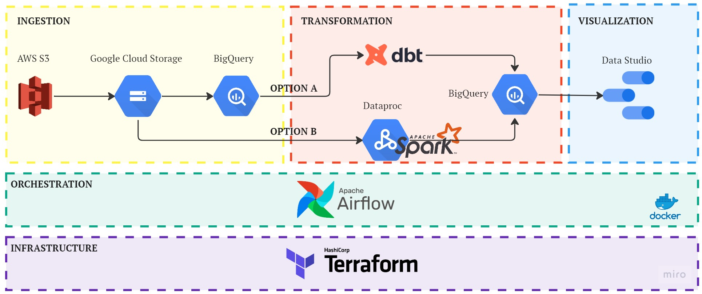
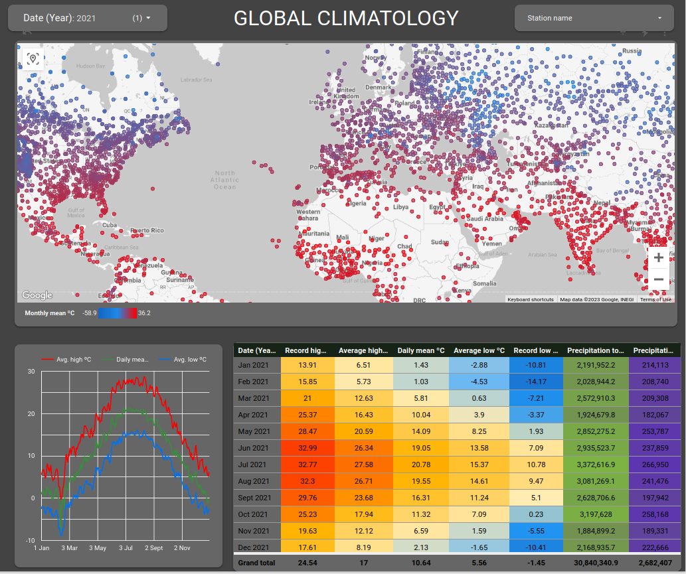
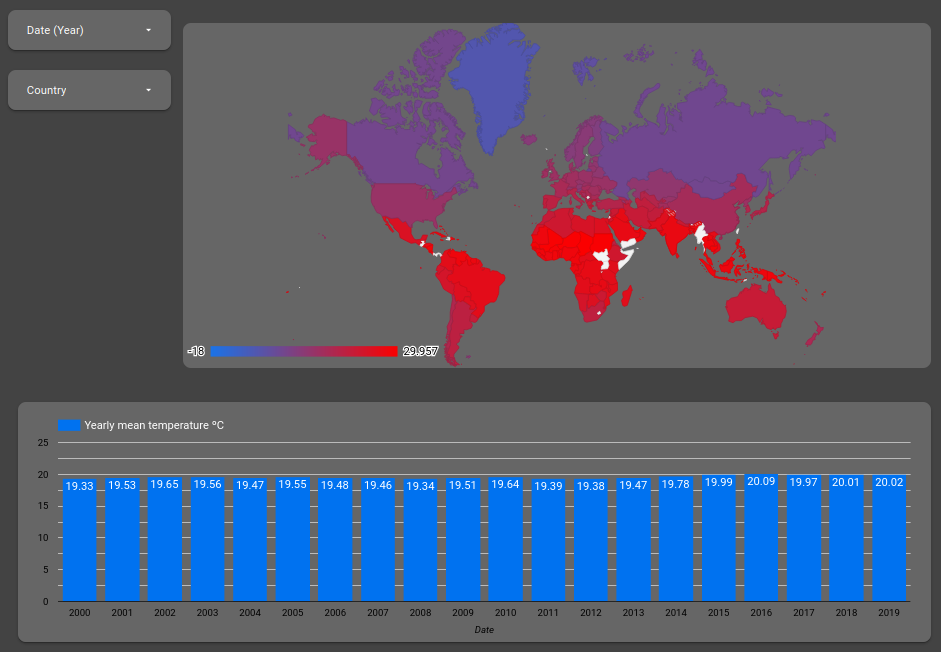

# End-to-end pipeline Climatology

## Summary 

End-to-end data pipeline orchestrated with Airflow that downloads climatology data from AWS, uploads it to GCP and transforms it in order to be visualized with Looker Studio.

## Dataset

[NOAA’s Global Historical Climatology Network](https://noaa-ghcn-pds.s3.amazonaws.com/index.html) is a dataset that contains daily observations over global land areas. The data is in CSV format. Each file corresponds to a year from 1763 to present and is named as such. It is updated daily.

## Tools & Technologies
* Cloud - [**Google Cloud Platform**](https://cloud.google.com/)
* Infraestructure as Code - [**Terraform**](https://www.terraform.io/)
* Containerization - [**Docker**](https://www.docker.com/), [**Docker Compose**](https://docs.docker.com/compose/)
* Orchestration - [**Airflow**](https://airflow.apache.org/)
* Transformation - [**Spark**](https://spark.apache.org/)
* Transformation - [**dbt**](https://www.getdbt.com/)
* Data Lake - [**Google Cloud Storage**](https://cloud.google.com/storage)
* Data Warehouse - [**BigQuery**](https://cloud.google.com/bigquery)
* Data Visualization - [**Looker Studio**](https://datastudio.google.com/)
* Testing - [**Great Expectations**](https://greatexpectations.io/)
* Testing - [**dbt test**](https://docs.getdbt.com/docs/build/tests/)
* CI/CD - [**Github Actions**](https://github.com/features/actions)
* Languages - **Python**, **SQL**

## Architecture

  

## Infrastructure

Terraform is used to create a bucket in GCS and a dataset in BigQuery

## Orchestration

Airflow is run (inside a Docker container) in order to orchestrate the data ingestion and transformation (only Option B) steps.

Orchestration of dbt cloud job (Option A) with Airflow requires access to the dbt cloud API, only available for team or enterprise plans. In this case the dbt job has to be run manually.

## Ingestion

Download raw data from the AWS S3 bucket, convert to parquet, upload to GCS and then create tables in BigQuery.

## Transformation(A)

dbt cloud is used to perform joins and aggregations in BigQuery.

## Transformation(B)

To compare different alternatives for the transformation step, Option B uses Dataproc (Google Cloud's managed service for Spark and Hadoop) to apply the same transformations as those of Option A, but reading the parquet files directly from the GCS bucket.

## Testing

In the early stage of the pipeline, some data quality checks are performed using Great Expectations

In the final stage of the pipeline, inside the dbt task some checks are performed using dbt test

## CI/CD

GitHub Actions triggers CI/CD pipelines. During the CI process the following tasks are triggered:

* Unit tests (pytest)
* Linting (Flake8)
* Formatter (Black)

## Visualization

Looker Studio dashboard can be found [here](https://datastudio.google.com/reporting/261d7fd7-0797-45a8-9f24-e7df9c0f26d5)

  

  

